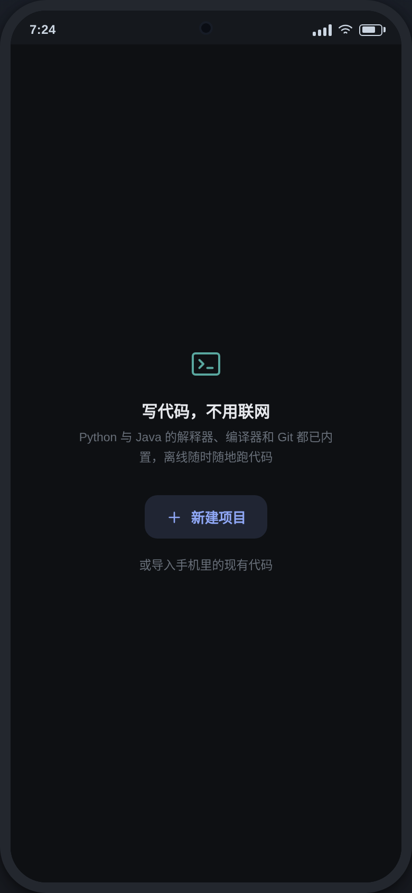
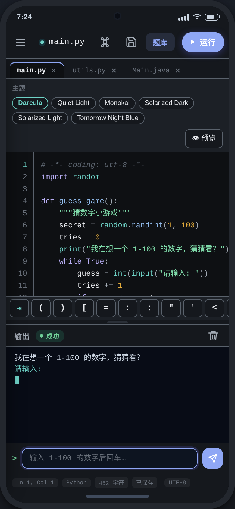
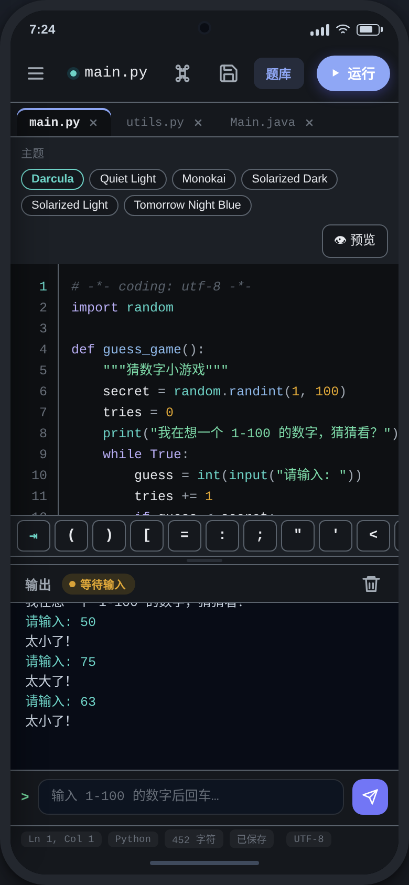
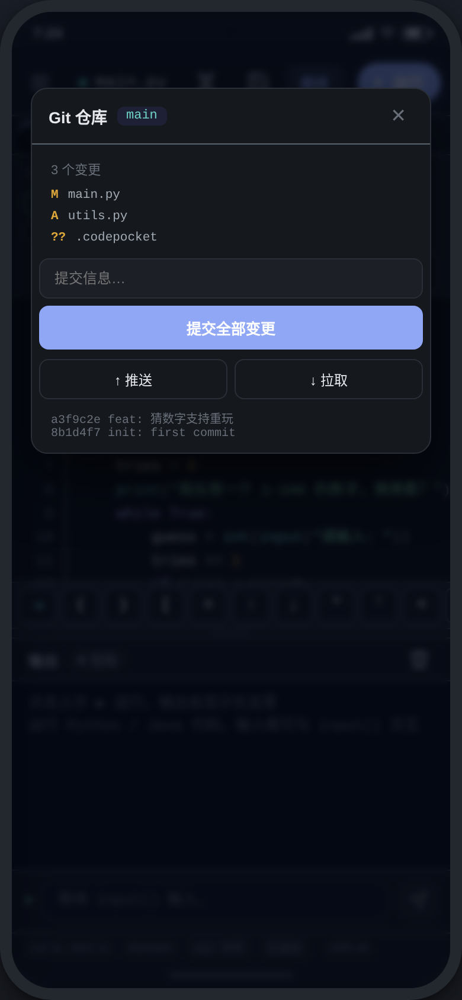
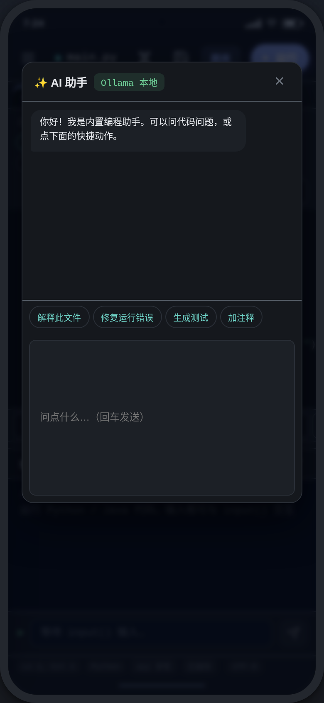
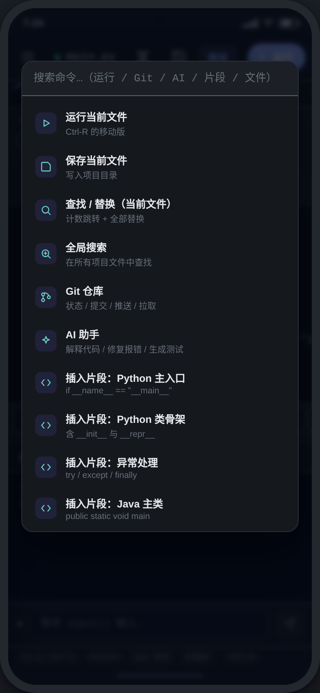

<div align="center">

# 📱 CodePocket 口袋码

**A truly offline Python IDE for Android — a modern coding environment on your phone, install and run.**

A natively cross-compiled CPython 3.13 (with C-extension stdlib modules) is bundled inside the APK. Zero downloads, zero network, zero ads, zero subscriptions.

[](LICENSE)
[](https://developer.android.com)
[](https://kotlinlang.org)
[]()
[]()

**[Download APK](https://gitcode.com/badhope/CodePocket/releases)** · **[Website](https://x33834.github.io/CodePocket/)** · **[Gitee Mirror](https://gitee.com/badhope/CodePocket)**

> Keep your IDE in your pocket — code offline, anywhere.

</div>

---

## ✨ Why CodePocket

| | Termux | Pydroid 3 | Acode | Spck | **CodePocket** |
|---|:---:|:---:|:---:|:---:|:---:|
| Offline after install | ⚠️ extra setup | ⚠️ partial | ❌ needs network | ❌ needs network | ✅ **runtime bundled** |
| Modern IDE UI | ❌ terminal only | ⚠️ dated | ✅ | ✅ | ✅ |
| Multi-file tabs / find & replace | ❌ | ✅ | ✅ | ✅ | ✅ |
| Offline Git | ✅ | ❌ | ✅ | ✅ | ✅ **JGit** |
| Native performance | ✅ | ✅ | — | — | ✅ **native ARM64** |
| AI assistant (BYOK) | ❌ | ❌ | ✅ cloud | ✅ cloud | ✅ **custom endpoint** |
| Open source & ad-free | ✅ GPL | ❌ paid | ⚠️ ads | ⚠️ IAP | ✅ **Apache-2.0** |

> Our positioning: **open source + ad-free + offline after install + native performance**.

---

## 📸 Screenshots & Demo

| Onboarding | Running | Output |
|---|---|---|
|  |  |  |

| Git | AI Assistant | Command Palette |
|---|---|---|
|  |  |  |

### Demo Video

<video src="design/promo.mp4" controls></video>

[▶ Download demo video](design/promo.mp4) · 24s · 0.6MB · no audio

---

## 🏗 Architecture

```
┌─────────────────────────────────────────────┐
│  Compose UI layer                            │
│  file tree · editor (Sora) · output · cmd    │
└──────────────────┬──────────────────────────┘
                   │ JNI (jobject callbacks)
┌──────────────────▼──────────────────────────┐
│  NativeEngine (Kotlin) + pybridge.c (JNI)    │
│  CPython 3.13 cross-compiled to arm64        │
│  streaming stdout/stderr · timeout · stdin   │
└──────────────────┬──────────────────────────┘
                   │ dlopen + sys.path
┌──────────────────▼──────────────────────────┐
│  jniLibs/arm64-v8a (bundled in APK)         │
│  libpython3.13.so · libpybridge.so · C ext   │
│  assets/python-stdlib.zip (pure-Python std)  │
└─────────────────────────────────────────────┘
```

**Core trade-off**: no custom terminal emulator, no external native toolchain dependency. CPython 3.13 is cross-compiled with the NDK into a native arm64 library and shipped inside the APK — offline after install. Only the Python runtime is integrated for now; Java (JVM) is not yet integrated (editing/highlighting only).

---

## 🎯 Features

### Write code
- **Multi-file tabs** · **file tree** (new / rename / delete, long-press actions)
- **Sora Editor** code editor + 18-language TextMate syntax highlighting
- **Static completion**: Python keywords / builtins + symbols from the current file (zero process overhead)
- **Find & replace** (count & jump) · **global search** (cross-file)
- **26-key symbol bar** · **pinch-to-zoom font size** · auto bracket closing · soft wrap · line number toggle
- **6 editor themes** (Darcula / Monokai / Tomorrow Night Blue / Solarized…)

### Run code
- **Native CPython 3.13 (arm64)**, full stdlib (pure-Python part + C extensions)
- **math / json / random / datetime / socket / ssl / sqlite3 / ctypes** and more C extensions bundled
- **Streaming output** · **`input()` interaction** · arrow-key / Tab soft keyboard
- **Infinite-loop protection** (timeout interrupt) · foreground service keep-alive
- **Friendly error translations** (20+ common errors)
- Run configuration (command-line args) · standard script attributes like `__file__`

### Manage projects
- **Multi-project switching** (long-press to delete) · **4 Python templates**
- **JGit Git integration**: init / commit / push / pull, pure Java, offline
- **SAF import/export** (no storage permission needed)
- **Offline package management**: inspect built-in modules / import local .whl

### See results
- **Markdown / HTML split-pane live preview**, debounced refresh
- **Open HTML files in external browser**
- **Output panel**: draggable height / copy all / share
- **3-mode theme** (follow system / light / dark)

### Be productive
- **Command palette ⌘K**: search every action + code snippets
- **AI assistant** (BYOK, OpenAI-compatible endpoint): explain files / fix errors / generate tests
- **Session restore**: return to your last editing session on restart
- **Crash logs** written to private storage, offline-friendly feedback

---

## 🚀 Quick Start

```bash
# 1) Prerequisites: JDK 17+, Android SDK (platforms;android-35, build-tools;34.0.0)
#    local.properties: sdk.dir=/path/to/android-sdk

# 2) Build the APK directly after cloning
./gradlew assembleDebug
adb install -r app/build/outputs/apk/debug/app-debug.apk

# 3) Open the app → create a project → write code → tap ▶ Run
```

The native runtime (`libpython3.13.so` + C extensions + pure-Python stdlib zip, ~100MB) is already in the repo, so **the app runs fully offline after build**.

> Rebuilding `libpybridge.so` requires the NDK 27.3 toolchain and a CPython 3.13 cross-compile environment — see `scripts/package_native.sh`. Not needed for daily builds: prebuilt artifacts are already in `app/src/main/jniLibs/`.

> `assets/python-stdlib.zip` must keep `noCompress` enabled (already configured); otherwise AAPT compression breaks CPython's stdlib loading.

---

## 📦 Bundled Runtime

- **Pure-Python stdlib**: `assets/python-stdlib.zip` (extracted to the app's private dir, then added to `sys.path`)
- **C extension modules**: math, json, _random, _datetime, _socket, _ssl, _sqlite3, _ctypes, zlib, binascii etc. (`jniLibs/arm64-v8a`)
- **numpy / pandas / matplotlib / pillow are NOT preinstalled** — `import numpy` shows a missing-module hint. Offline installation of third-party wheels is planned for a later release.

---

## 📚 Documentation

| Doc | About | Language |
|---|---|---|
| [Branding](docs/BRANDING.md) | Naming, positioning, slogan, visual guidelines | 中文 |
| [Introduction](docs/INTRODUCTION.md) | One-page project intro for website / promotion | 中文 |
| [User Guide](docs/USER_GUIDE.md) | Install, UI, run, Git, AI — full manual | 中文 |
| [Architecture](docs/ARCHITECTURE.md) | Engine, JNI bridge, threading model, layout | 中文 |
| [Roadmap](docs/ROADMAP.md) | Done / in progress / planned | 中文 |
| [Promotion Pack](docs/PROMOTION.md) | Store description, release notes, social copy | 中文 |
| [FAQ](docs/FAQ.md) | Frequently asked questions | 中文 |
| [Contributing](CONTRIBUTING.md) | How to get involved | English |
| [Code of Conduct](CODE_OF_CONDUCT.md) | Contributor Covenant | English |
| [Security](SECURITY.md) | Vulnerability reporting | English |

---

## 🧭 Capability Boundaries (honest notes)

| Capability | Status |
|---|---|
| Python runtime | ✅ Full (native CPython 3.13, arm64) |
| Java runtime | ❌ JVM not yet integrated (editing/highlighting only) |
| Performance | ✅ Native execution, no WASM sandbox overhead |
| Sci-stack libraries | ⚠️ numpy/pandas/matplotlib not preinstalled; offline import planned |
| pip online install | ❌ Offline-first; extra libraries via manual wheel import |

---

## 🤝 Contributing

All contributions are welcome: file issues, improve docs, fix bugs, add features.

Run `python3 tools/selfcheck.py` before submitting (0 errors), see [CONTRIBUTING.md](CONTRIBUTING.md).

---

## 📄 License

[Apache License 2.0](LICENSE) · third-party component notices in [NOTICE.md](NOTICE.md)

---

*CodePocket「口袋码」— keep your IDE in your pocket, code offline anywhere.*
